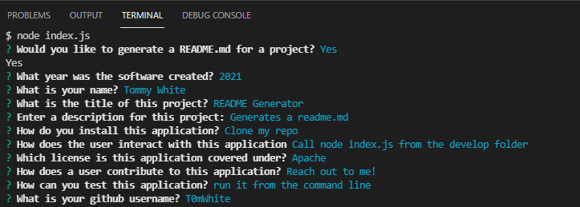

# Readme gen

  ## Description
  
Generates a readme
  
  ## Table of Contents
  
  - [Installation](#installation)
  - [Usage](#usage)
  - [License](#license)
  - [Contributing](#contributing)
  - [Tests](#tests)
  - [Questions](#questions)
  
  
  
  ## Installation
  
Clone the repository
  
  ## Usage
  
Install the dependencies and run the application from the command line. Check out the example video and image.

[Youtube Video of Application in Action](https://youtu.be/L1EJCYBBJR0)

  ## License

[Coffeeware](https://github.com/Sonic853/coffeeware-license)
     License

        
  
  ## Contributing
  
Contact me
  
  ## Tests
  
Run the application
  
  ## Questions
  
email me
  
  #### Github
  
  https://github.com/T0mWhite
  
  #### Email
  
tbw2.mail@gmail.com
  
  
  

